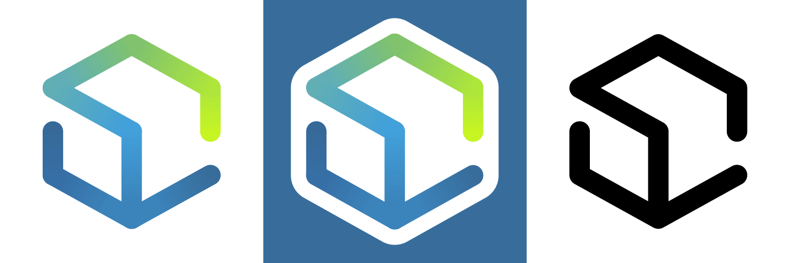
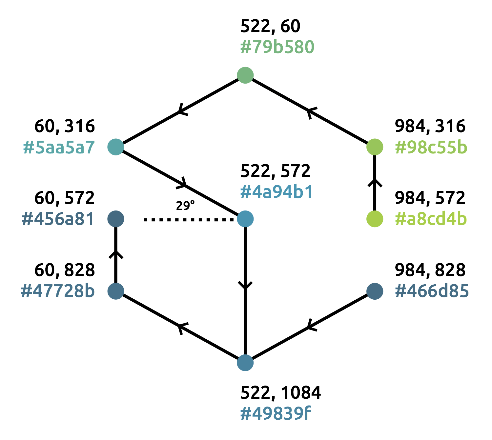
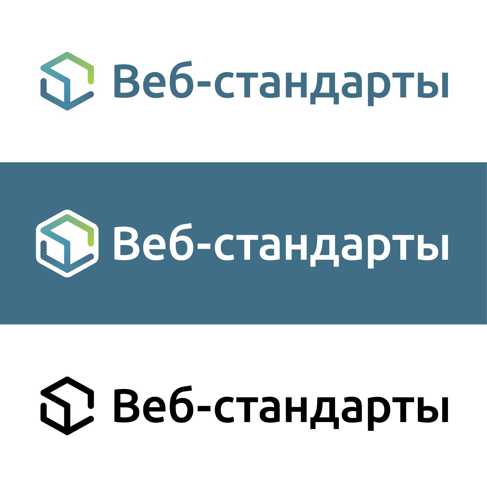

# Логотип сообщества «Веб-стандарты»

Руководство по использованию логотипа и фирменного стиля «Веб-стандартов». Дизайн [Сони Мадвекс](https://www.behance.net/mudvex), реализация и руководство [Вадима Макеева](https://github.com/pepelsbey).

## Название

Название «Веб-стандарты» записывается через дефис с первой прописной буквы. В контексте русскоязычного предложения записывается в кавычках, допустимо написание без кавычек (но с прописной) для ссылок и специальных контекстов.

Полное название «Сообщество „Веб-стандарты“», обратите внимание на изменение вложенных кавычек. Это **сообщество**, не комьюнити, не проект, не объединение.

## Знак

Знак представляет собой изомерическую проекцию куба, через грани которого идёт линейный градиент. Логотип на тёмном фоне идёт на белой подложке, монохромная версия заливает грани нужным цветом.

SVG: [светлый](light.svg), [тёмный](dark.svg), [монохромный](mono.svg).

## Построение

Исходный логотип строится в SVG с помощью восьми линий, составляющих первую и вторую ломаную. Каждый отрезок залит линейным градиентом от начальной до конечной точки. В градиенты внесены смещения для лучшего совпадения цветов на стыках. Угол для построения 29°. Вьюпорт светлой и монохромной версии 1044 × 1144, тёмной версии с подложкой 1224 × 1324 пикселя.

## Точки и цвета ломаных

| Первая |      |        | Вторая |      |        |
|--------|------|--------|--------|------|--------|
| x1     | y1   | Цвет   | x1     | y1   | Цвет   |
| 984    | 572  | a8cd4b | 984    | 828  | 466d85 |
| 984    | 316  | 98c55b | 522    | 1084 | 49839f |
| 522    | 60   | 79b580 | 60     | 828  | 47728b |
| 60     | 316  | 5aa5a7 | 60     | 572  | 456a81 |
| 522    | 572  | 4a94b1 |        |      |        |
| 522    | 1084 | 49839f |        |      |        |

## Логотип

SVG: [светлый](light-type.svg), [тёмный](dark-type.svg), [монохромный](mono-type.svg). Текст набран шрифтом Ubuntu Medium.

## Цвета

| Цвет | Зелёный      | Голубой       | Синий         |
|------|--------------|---------------|---------------|
| HEX  | a7cf40       | 489dbd        | 416e87        |
| RGB  | 72, 157, 189 | 72, 157, 189  | 65, 110, 135  |
| CMYK | 40, 0, 96, 0 | 70, 24, 17, 0 | 79, 49, 33, 8 |

## Благодарности

- [Дмитрию Барановскому](https://github.com/DmitryBaranovskiy) за помощь с SVG-версией.
- Академии HTML за [идею с руководством](https://github.com/htmlacademy/logo).

---
Распространяется по лицензии [CC-BY-SA 4.0](https://creativecommons.org/licenses/by-sa/4.0/deed.ru)