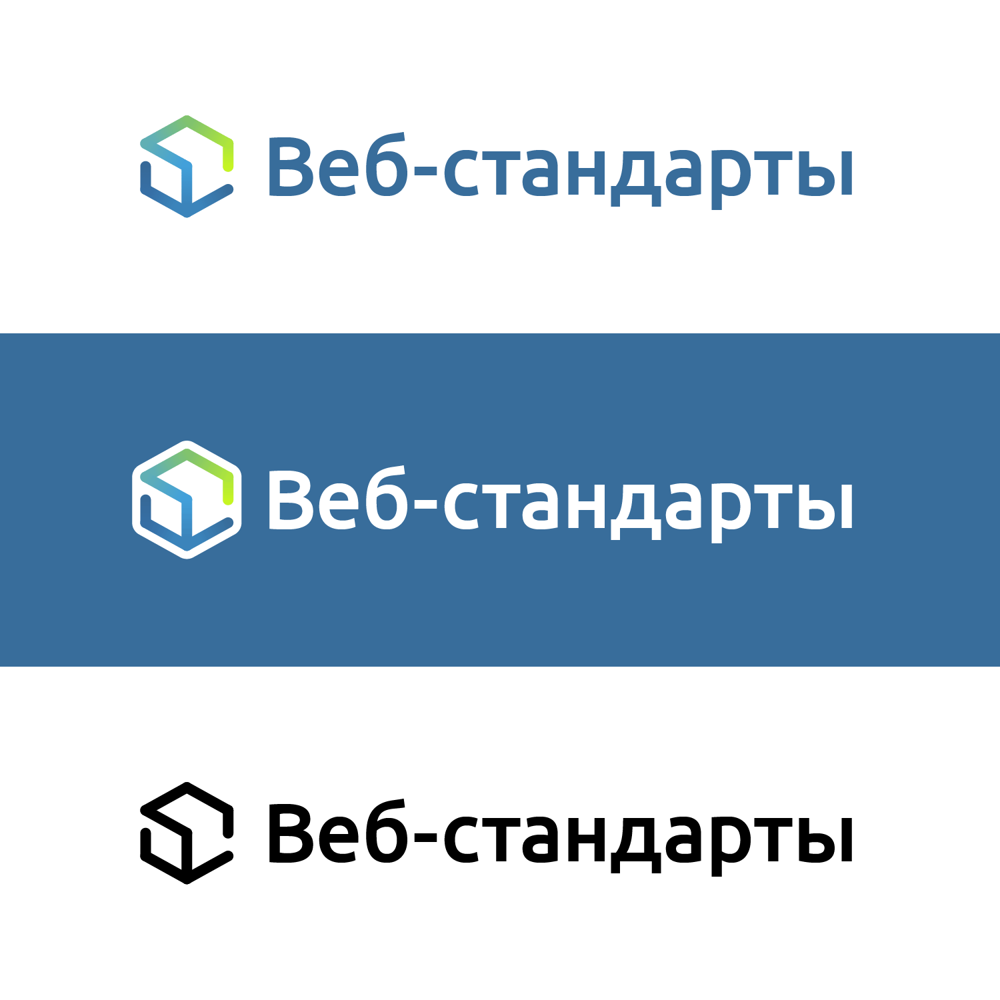

# Логотипы сообщества «Веб-стандарты»

Руководство по использованию логотипа и фирменного стиля «Веб-стандартов». Дизайн [Сони Мадвекс](https://www.behance.net/mudvex), реализация и руководство [Вадима Макеева](https://github.com/pepelsbey).

## Знак

Знак представляет собой изометрическую проекцию куба, через грани которого идёт линейный градиент. Логотип на тёмном фоне идёт на белой подложке, монохромная версия заливает грани нужным цветом.

SVG: [светлый](logo/light.svg), [тёмный](logo/dark.svg), [монохромный](logo/mono.svg).

### Построение

Знак строится в SVG с помощью восьми линий, составляющих первую и вторую ломаную. Каждый отрезок залит линейным градиентом от начальной до конечной точки. В градиенты внесены смещения для лучшего совпадения цветов на стыках. Угол для построения 29°. Вьюпорт светлой и монохромной версии 1044 × 1144, тёмной версии с подложкой 1224 × 1324 пикселя.

### Точки и цвета ломаных

| Первая |      |        | Вторая |      |        |
|--------|------|--------|--------|------|--------|
| x1     | y1   | Цвет   | x1     | y1   | Цвет   |
| 984    | 572  | c6f523 | 984    | 828  | 386d9b |
| 984    | 316  | afe63a | 522    | 1084 | 3b84bb |
| 522    | 60   | 81c36d | 60     | 828  | 366fa5 |
| 60     | 316  | 61afb4 | 60     | 572  | 366998 |
| 522    | 572  | 42a0da |        |      |        |
| 522    | 1084 | 3b84bb |        |      |        |

## Цвета

| Цвет | Зелёный       | Голубой      | Синий        |
|------|---------------|--------------|--------------|
| HEX  | 81c36d        | 42a0da       | 386d9b       |
| RGB  | 129, 195, 109 | 66, 160, 218 | 56, 109, 155 |

## Веб-стандарты

Название _«Веб-стандарты»_ пишется через дефис с первой прописной буквы, сокращается до акронимов ВСТ или WST. В контексте русскоязычного предложения пишется в кавычках (за исключением акронимов), допустимо написание без кавычек (но с прописной) для ссылок и специальных контекстов. Полное название «Сообщество „Веб-стандарты“». Это **сообщество**, не комьюнити, не проект, не объединение.

### Логотип

SVG: [светлый](wst/light.svg), [тёмный](wst/dark.svg), [монохромный](wst/mono.svg). Текст набран шрифтом [Ubuntu Medium](http://font.ubuntu.com/#charset-medium).

## Web Standards Days

Название _Web Standards Days_ (дни веб-стандартов) пишется латиницей в три слова, каждое начинается с прописной; сокращается до аббревиатуры WSD. Во всех контекстах пишется без кавычек. Обратите внимание на окончание слова «standards» и множественное число слова «days». Это **конференция**, не встреча, не митап, не ивент.

### Логотип

SVG: [светлый](wsd/light.svg), [тёмный](wsd/dark.svg), [монохромный](wsd/mono.svg). Текст набран шрифтом [Ubuntu Medium](http://font.ubuntu.com/#charset-medium).

## Благодарности

- [Дмитрию Барановскому](https://github.com/DmitryBaranovskiy) за помощь с SVG-версией.
- Академии HTML за [идею с руководством](https://github.com/htmlacademy/logo).

---
Распространяется по лицензии [CC-BY-SA 4.0](https://creativecommons.org/licenses/by-sa/4.0/deed.ru)
