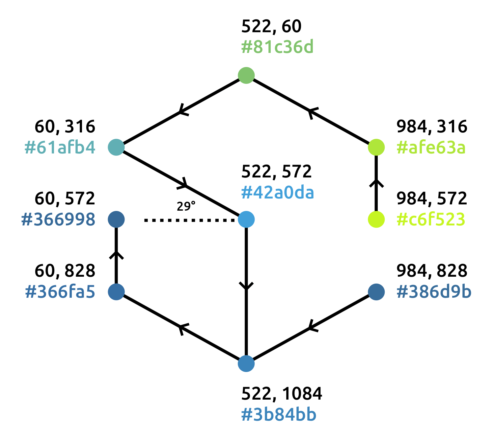

# Фирменный стиль сообщества «Веб-стандарты»

Руководство по использованию логотипа и фирменного стиля «Веб-стандартов». Дизайн [Сони Мадвекс](https://www.behance.net/mudvex), реализация и руководство [Вадима Макеева](https://github.com/pepelsbey).

## Название

Название «Веб-стандарты» записывается через дефис с первой прописной буквы. В контексте русскоязычного предложения записывается в кавычках, допустимо написание без кавычек (но с прописной) для ссылок и специальных контекстов.

Полное название «Сообщество „Веб-стандарты“», обратите внимание на изменение вложенных кавычек. Это сообщество, не комьюнити, не проект, не объединение.

## Знак

Знак представляет собой изомерическую проекцию куба, через грани которого идёт линейный градиент. Впервые идея кубов, как стандартной, простой фигуры, появилась в первом логотипе «Веб-стандартов» из трёх цветных квадратов и объёмной версии из кубов.

## Цвета

- Зелёный
	- `#a7cf40`
	- `rgb(167, 207, 64)`
	- `cmyk(40%, 0, 96%, 0)`
- Голубой
	- `#489dbd`
	- `rgb(72, 157, 189)`
	- `cmyk(70%, 24%, 17%, 0)`
- Синий
	- `#416e87`
	- `rgb(65, 110, 135)`
	- `cmyk(79%, 49%, 33%, 8%)`

## Построение

Исходный логотип строится в SVG с помощью восьми линий, составляющих первую и вторую ломаную.

Каждый отрезок залит линейным градиентом от начальной до конечной точки. В градиенты внесены смещения для лучшего совпадения цветов на стыках.

Угол для построения 29°.

# Точки и цвета

### Первая

1. 984, 572 `#a8cd4b`
2. 984, 316 `#98c55b`
3. 522, 60 `#79b580`
4. 60, 316 `#5aa5a7`
5. 522, 572 `#4a94b1`
6. 522, 1084 `#49839f`

### Вторая

1. 984, 828 `#466d85`
2. 522, 1084 `#49839f`
3. 60, 828 `#47728b`
4. 60, 572 `#456a81`

## Благодарности

- [Дмитрию Барановскому](https://github.com/DmitryBaranovskiy) за помощь с SVG-версией
- Академии HTML за [идею с руководством](https://github.com/htmlacademy/logo)